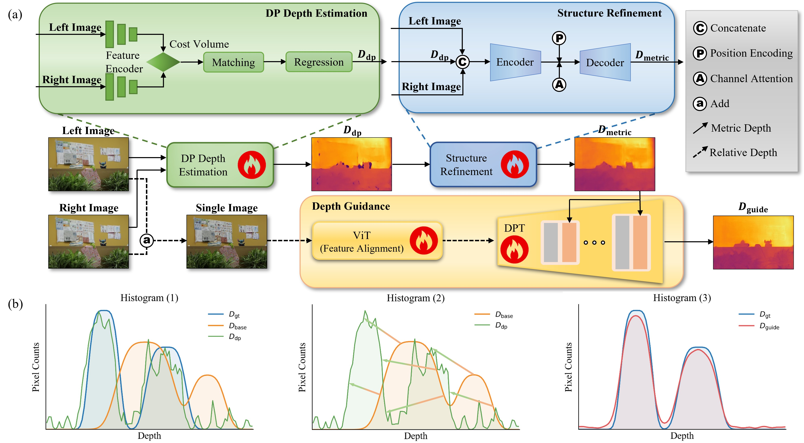

<div align="center">
  <h2><strong>FoundDP: Revisiting Weak Disparity Observability in Dual-Pixel Depth Estimation</strong></h2>
  <p>
    <strong>Accepted by ECCV 2026</strong> 🎉 <br>
    <a href="https://github.com/LinYark" target="_blank" rel="noopener noreferrer">Fengchen He</a>*, 
    <a href="https://github.com/MorLin0825" target="_blank" rel="noopener noreferrer">Hao Xu</a>*, 
    Dayang Zhao, 
    Tingwei Quan, 
    Shaoqun Zeng <br>
    * Equal contribution <br>
    HUST, China
  </p>

  <p>
    <a href="https://arxiv.org/abs/2607.01900" target="_blank" rel="noopener noreferrer">
      📚 arXiv
    </a> &nbsp;&nbsp;|&nbsp;&nbsp;
    <a href="docs/papers/FoundDP_paper.pdf" target="_blank" rel="noopener noreferrer">
      📄 Paper
    </a> &nbsp;&nbsp;|&nbsp;&nbsp;
    <a href="docs/papers/FoundDP_supp.pdf" target="_blank" rel="noopener noreferrer">
      🧾 Supp
    </a> &nbsp;&nbsp;|&nbsp;&nbsp;
    <!-- <a href="#" target="_blank" rel="noopener noreferrer">
      📦 Dataset
    </a> &nbsp;&nbsp;|&nbsp;&nbsp; -->
    <!-- <a href="https://xxxxxxxxxxxx" target="_blank" rel="noopener noreferrer"> -->
      🔗 Website
    </a>
  </p>
</div>


## ✍️ TL;DR
**FoundDP** combines **metric dual-pixel depth** with **monocular foundation model priors** for robust depth estimation under weak disparity. It improves both structural fidelity and metric accuracy in challenging DP imaging scenarios.

<div align="center">
  
</div>


# 🛠️ Code & Dataset Release Plan
- ✅ Paper available on arXiv with citation examples
- 🚧 Open-source FoundDP in stages:
  - [ ] Demo
  - [ ] Dataset
  - [ ] Full source code
- 🔐 Full code will be released **after the paper is officially published**


## Citations
We appreciate a star ⭐ if you'd like to follow future updates.
If you find it useful, please consider citing our paper:
```bibtex
@article{he2026founddp,
  title={FoundDP: Revisiting Weak Disparity Observability in Dual-Pixel Depth Estimation},
  author={He, Fengchen and Xu, Hao and Zhao, Dayang and Quan, Tingwei and Zeng, Shaoqun},
  journal={arXiv preprint arXiv:2607.01900},
  year={2026}
}
```

## Acknowledgments
This work was supported by National Natural Science Foundation of China (Grant No. 32471146) and the project N20240194. The authors thank Echossom, Miya, and Xinge for valuable discussions and assistance.

---
## Lastly
If you are also interested in exploring structural parameters of dual-pixel sensors from other cameras, or in conducting further optical simulations on quad-pixel structures, you are always welcome to contact [us](https://github.com/LinYark).

<!-- 🤔 Btw, We are seeking help from any engineer familiar with Dual/Quad-Pixel sensors. (⚡plz contact [us](https://github.com/LinYark), crying⚡). -->

